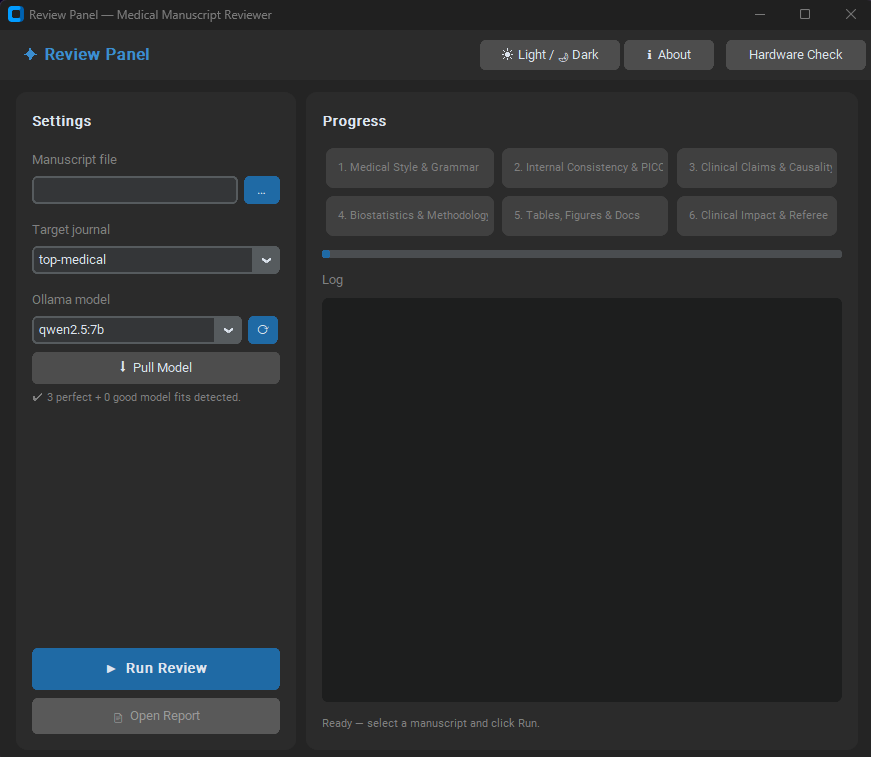
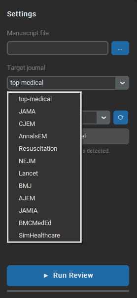
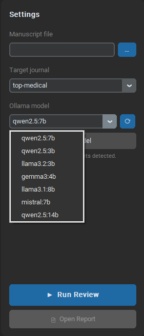

# Review Panel

**AI-powered pre-submission review for medical manuscripts — runs entirely on your own computer.**

Review Panel reads your manuscript and runs it through 6 specialist AI reviewers, each focusing on a different aspect: language and style, internal consistency, clinical claims, statistics, tables and figures, and overall scientific impact. The result is a structured report in the same format a real journal referee would use.

Everything runs locally. Your manuscript never leaves your machine.

---

## What you need before starting

- A Windows, Mac, or Linux computer
- At least **8 GB of RAM** (16 GB recommended)
- A dedicated GPU with 6+ GB VRAM gives the best results, but the app works on CPU-only machines (slower)
- An internet connection for the first-time setup only

---

## Installation

### Windows

1. Go to the [Releases page](https://github.com/altugkanbakan/reviewpanel-desktop/releases)
2. Download `ReviewPanel_Setup.exe`
3. Run the installer and follow the steps
4. Launch **Review Panel** from the Start menu

### macOS

Before installation, check your OS version. macOS 14 (Sonoma) and later verisons are compatible with Ollama.
If you have older macOS that not supported, you can upgrade the OS with [OpenCore-Patcher](https://github.com/dortania/OpenCore-Legacy-Patcher/releases) 
1. Go to the [Releases page](https://github.com/altugkanbakan/reviewpanel-desktop/releases)
2. Download `ReviewPanel-macOS.dmg`
3. Open the DMG and move `ReviewPanel.app` to your Applications folder
4. Double-click to open

> If macOS says the app "cannot be opened because the developer cannot be verified", go to **System Settings → Privacy & Security** and click **Open Anyway**.

### Linux

1. Go to the [Releases page](https://github.com/altugkanbakan/reviewpanel-desktop/releases)
2. Download `ReviewPanel`
3. Open a terminal in the download folder and run:
   ```bash
   chmod +x ReviewPanel
   ./ReviewPanel
   ```

---

## First-time setup

When you open Review Panel for the first time:

1. **Hardware Check** — Click the *Hardware Check* button in the top bar. The app will scan your GPU and RAM and suggest which AI models will run well on your machine.

2. **Install Ollama** — If Ollama is not installed, the app will offer to install it for you automatically. Click *Install* and wait for it to finish. Ollama is the engine that runs the AI models locally.

3. **Download a model** — Select a model from the dropdown list. Models marked *Perfect* will be fast and accurate on your hardware. Click *Pull Model* to download it. This takes a few minutes depending on your internet speed.

You only need to do this once. After setup, the app opens directly to the review screen.

---

## How to use



The interface is split into two panels. The **Settings panel** on the left is where you configure and launch your review. The **Progress panel** on the right shows the live output from each of the 6 AI reviewer agents.

### Step 1 — Load your manuscript

Click the **`...`** button next to *Manuscript file* and select your `.docx` file.

### Step 2 — Select a target journal

Click the *Target journal* dropdown to choose the journal you are submitting to.



Available profiles include **JAMA, NEJM, Lancet, BMJ, CJEM, AnnalsEM, Resuscitation, AJEM, JAMIA, BMCMedEd, SimHealthcare**, and **top-medical** (a combined top-tier standard for when you haven't decided on a journal yet).

### Step 3 — Choose an AI model

Click the *Ollama model* dropdown to select the model you want to use for the review.



Models already pulled in Ollama appear here automatically. The refresh button (🔄) next to the dropdown reloads the list. If a model you want is not listed, type its name and click **Pull Model** to download it.

> Models with more parameters (e.g. `qwen2.5:14b`) produce more detailed and accurate reviews but require more RAM and VRAM and run slower.

### Step 4 — Run the review

Click **▶ Run Review**. The 6 agent panels on the right will light up one by one as each reviewer completes its section. A progress bar and live log show what is happening. Reviews typically take 5–15 minutes depending on your hardware and model.

### Step 5 — Open the report

When all 6 agents finish, click **Open Report** to view and save the review as a Markdown file.

The report includes:
- Language, style and patient-first terminology issues
- Abstract vs. main text consistency check
- Causal language and clinical claim discipline
- Statistical reporting completeness
- Tables and figures check
- Overall scientific impact rating with a referee recommendation

---

## Frequently asked questions

**Does my manuscript get sent to the internet?**
No. Everything runs on your own machine through Ollama. No data is transmitted anywhere.

**How long does a review take?**
Typically 5–15 minutes depending on your hardware and model. A dedicated GPU with a larger model gives faster, better results.

**What file formats are supported?**
Currently `.docx` (Microsoft Word). PDF support is planned for a future version.

**The hardware check button doesn't work — what do I do?**
The hardware check requires a small companion tool called **llmfit**. Download it separately and place it next to the Review Panel executable:

1. Go to the [llmfit releases page](https://github.com/AlexsJones/llmfit/releases/tag/v0.8.0)
2. Download the correct file for your system:

| System | File to download |
|--------|-----------------|
| Windows (most computers) | `llmfit-v0.8.0-x86_64-pc-windows-msvc.zip` |
| Mac (M1/M2/M3) | `llmfit-v0.8.0-aarch64-apple-darwin.tar.gz` |
| Mac (Intel) | `llmfit-v0.8.0-x86_64-apple-darwin.tar.gz` |
| Linux (most) | `llmfit-v0.8.0-x86_64-unknown-linux-gnu.tar.gz` |

3. Extract the archive and place the `llmfit` (or `llmfit.exe` on Windows) file in the **same folder** as `ReviewPanel.exe` / `ReviewPanel.app` / `ReviewPanel`
4. Restart Review Panel — the hardware check button will now work

> A future update (v2.2) will remove this manual step entirely.

**Can I use a model I already have installed in Ollama?**
Yes. Any model already pulled in Ollama will appear in the dropdown automatically.

---

## License

Free for personal and academic use under AGPL v3.
Commercial license available for institutional and specialty deployments — contact via [LinkedIn](https://linkedin.com/in/drkanbakan).

**Developer:** Altuğ Kanbakan — [GitHub](https://github.com/altugkanbakan) · [LinkedIn](https://linkedin.com/in/drkanbakan)
