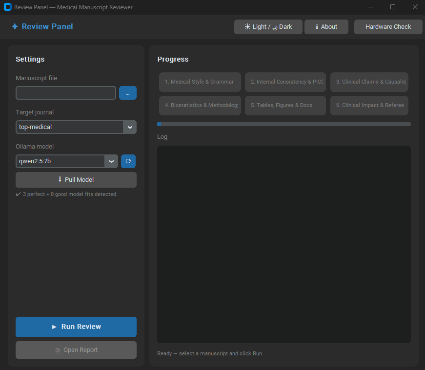
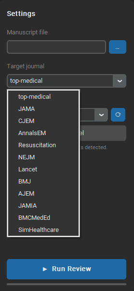
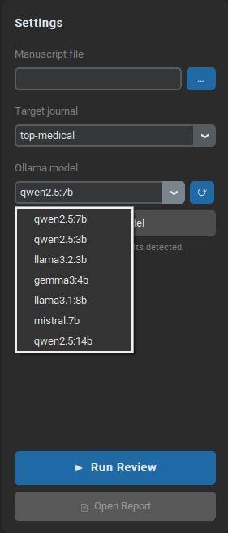

# Review Panel

**AI-powered pre-submission review for medical manuscripts — runs entirely on your own computer.**

Review Panel reads your manuscript and runs it through 6 specialist AI reviewers, each focusing on a different aspect: language and style, internal consistency, clinical claims, statistics, tables and figures, and overall scientific impact. The result is a structured report in the same format a real journal referee would use.

Everything runs locally. Your manuscript never leaves your machine.

> **Warning**: Review Panel is not a decision-making authority. AI reviewers can make mistakes, and their output must be verified manually before you act on it. Under the 2025 ICMJE and COPE guidelines, reviewing manuscripts that contain sensitive information (such as protected health information), original hypotheses, or material already submitted to a journal with *cloud-based* AI tools would violate confidentiality — Review Panel avoids that specific problem by running entirely on your own machine. One obligation applies regardless: the use of AI for tasks such as fact-checking and editing requires disclosure.

---

## What you need before starting

- A Windows, Mac, or Linux computer
- At least **8 GB of RAM** (16 GB recommended)
- A dedicated GPU with 6+ GB VRAM gives the best results, but the app works on CPU-only machines (slower)
- An internet connection for the first-time setup only

---

## Installation

### Windows

1. Go to the [Releases page](https://github.com/altugkanbakan/reviewpanel-desktop/releases)
2. Download `ReviewPanel.exe`
3. Run it — there is no installation step

### macOS

Before installation, check your OS version. macOS 14 (Sonoma) and later versions are compatible with Ollama.
If you have older macOS that not supported, you can upgrade the OS with [OpenCore-Patcher](https://github.com/dortania/OpenCore-Legacy-Patcher/releases) 
1. Go to the [Releases page](https://github.com/altugkanbakan/reviewpanel-desktop/releases)
2. Download `ReviewPanel-macOS.dmg`
3. Open the DMG and move `ReviewPanel.app` to your Applications folder
4. Double-click to open

> If macOS says the app "cannot be opened because the developer cannot be verified", go to **System Settings → Privacy & Security** and click **Open Anyway**.

### Linux

1. Go to the [Releases page](https://github.com/altugkanbakan/reviewpanel-desktop/releases)
2. Download `ReviewPanel`
3. Open a terminal in the download folder and run:
   ```bash
   chmod +x ReviewPanel
   ./ReviewPanel
   ```

---

## First-time setup

When you open Review Panel for the first time:

1. **Hardware Check** — Click the *Hardware Check* button in the top bar. The app will scan your GPU and RAM and suggest which AI models will run well on your machine.

2. **Install Ollama** — If Ollama is not installed, the app will offer to install it for you automatically. Click *Install* and wait for it to finish. Ollama is the engine that runs the AI models locally.

3. **Download a model** — Select a model from the dropdown list. Models marked *Perfect* will be fast and accurate on your hardware. Click *Pull Model* to download it. This takes a few minutes depending on your internet speed.

You only need to do this once. After setup, the app opens directly to the review screen.

---

## How to use



The interface is split into two panels. The **Settings panel** on the left is where you configure and launch your review. The **Progress panel** on the right shows the live output from each of the 6 AI reviewer agents.

### Step 1 — Load your manuscript

Click the **`...`** button next to *Manuscript file* and select your manuscript.
Word (`.docx`), LaTeX (`.tex`), Markdown (`.md`) and plain text (`.txt`) are
supported. A `.tex` file that pulls in chapters with `\input` or `\include` is
followed and assembled automatically.

### Step 2 — Select a target journal

Click the *Target journal* dropdown to choose the journal you are submitting to.



**JAMA**, **CJEM**, **AnnalsEM** and **Resuscitation** ship a detailed profile —
desk-reject triggers, methodology and statistical requirements, and the tone the
final reviewer adopts. **NEJM, Lancet, BMJ, AJEM, JAMIA, BMCMedEd** and
**SimHealthcare** are selectable and reviewed against top-tier general medical
standards.

**top-medical** is the default and applies those same standards: generalizable
evidence, the reporting guideline that matches your design (CONSORT for trials,
STROBE for observational work), confidence intervals with exact p-values, and a
clear clinical bottom line.

### Step 3 — Choose an AI model

Click the *Ollama model* dropdown to select the model you want to use for the review.



Models already pulled in Ollama appear here automatically. The refresh button (⟳) next to the dropdown reloads the list. If a model you want is not listed, type its name and click **Pull Model** to download it.

The default is **`qwen3:4b-instruct-2507-q4_K_M`**. Bigger is not automatically
better here: what matters most is whether the model fits in your graphics card's
memory, because a model that does not fit runs partly on the CPU and slows down
sharply. On a 6 GB card the boundary sits near 3.8 GB of model weights — a 4.7 GB
7B model left 18% of its layers on the CPU and ran at a third of the speed of a
4B model that fitted entirely.

Avoid heavily compressed builds (`q3` and below). They are smaller and faster,
but compression damages instruction-following first: in testing, a `q3` model
altered a quotation it claimed to be citing and reported an error for text that
was not in the manuscript at all.

If you have more than 8 GB of VRAM, a larger model will give more thorough
reviews. Use *Hardware Check* to see what your machine can hold.

### Step 4 — Run the review

Click **▶ Run Review**. The 6 agent panels on the right light up one by one as
each reviewer finishes. The log shows the review as it is written, along with the
generation speed and an estimate of the time left.

With the default model on a 6 GB laptop GPU a review takes roughly 5 minutes;
a larger model or a CPU-only machine takes longer.

If the review is interrupted — a crash, a closed window, a stopped Ollama — the
finished agents are kept. Starting the same manuscript again offers to reuse
them, and reviewing an unchanged manuscript a second time returns almost
immediately.

### Step 5 — Open the report

When all 6 agents finish, click **Open Report** to view and save the review as a Markdown file.

The report includes:
- Language, style and patient-first terminology issues
- Abstract vs. main text consistency check
- Causal language and clinical claim discipline
- Statistical reporting completeness
- Tables and figures check
- Overall scientific impact rating with a referee recommendation

---

## Frequently asked questions

**Does my manuscript get sent to the internet?**
No. Everything runs on your own machine through Ollama. No data is transmitted anywhere.

**How long does a review take?**
About 5 minutes with the default model on a 6 GB laptop GPU. Larger models and
CPU-only machines take longer. Reviewing the same manuscript again reuses the
earlier result and finishes almost at once.

**What file formats are supported?**
Word (`.docx`), LaTeX (`.tex`), Markdown (`.md`) and plain text (`.txt`).

PDF is not supported and is refused rather than accepted: a PDF read as plain
text produces garbled prose, and a review of garbled prose looks convincing
while being worthless. Export to Word or plain text first.

**Can I use a model I already have installed in Ollama?**
Yes. Any model already pulled in Ollama will appear in the dropdown automatically.

---

## Running from source

```bash
git clone https://github.com/altugkanbakan/reviewpanel-desktop.git
cd reviewpanel-desktop
pip install -r requirements.txt
python src/gui.py
```

`src/` holds the application, `packaging/` the PyInstaller specs and build
scripts, and `tests/` the test suite:

```bash
pip install -r requirements-dev.txt
pytest
```

To build a standalone executable, run the script for your platform from
`packaging/` (`build.bat`, `build_mac.sh`, `build_linux.sh`). Each fetches the
`llmfit` hardware-check helper and bundles it. GitHub Actions builds all three
platforms on every push and attaches them to tagged releases.

Prefer the command line? The original CLI edition of Review Panel is available
at [altugkanbakan/ReviewPanel](https://github.com/altugkanbakan/ReviewPanel).

---

## License

Free for personal and academic use under AGPL v3.
Commercial license available for institutional and specialty deployments — contact via [LinkedIn](https://linkedin.com/in/drkanbakan).

**Developer:** Altuğ Kanbakan — [GitHub](https://github.com/altugkanbakan) · [LinkedIn](https://linkedin.com/in/drkanbakan)
